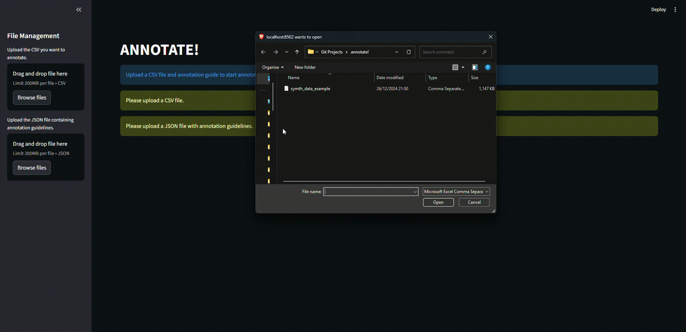

# ANNOTATE!

A **Streamlit-based annotation tool** designed to assist the annotation of the RorshIA project.  
This app allows to validate automatically generated **Content** and **Determinant** labels in the data_exmaple.csv file, compare them with the original labels, and annotate with validated labels.

---



## Input Files

The app requires **two files**:

### 1. Data CSV File  
Containing the responses and existing annotations.  
Must include the following columns:

- `sent` — the sentence or response text  
- `original_cont_label` — the original content label  
- `original_det_label` — the original determinant label  
- `annotated_cont_labels` — automatically generated content label(s)  
- `annotated_det_labels` — automatically generated determinant label(s)

---

### 2. Labels explanations JSON File  
Containing explanations for each annotation category, formatted as:

```json
{
    "conts": {
        "LABEL": "explanation.",
    },
    "dets": {
        "LABEL": "explanation.",
    }
}
```

---

## Requirements

The webapp only needs streamlit and pandas. You can install those dependencies with:

```bash
pip install -r requirements.txt
```

If you want to run the tool locally, type:

```bash
python -m streamlit run annotate.py
```
